# 

1.  **Log In and Sign Up:** When you first open our app, you\'ll see
    > screens where you can either log in if you already have an account
    > or make a fresh account. Don\'t worry, everything\'s safe with
    > Firebase, a tech wizard that keeps things secure.\
    > 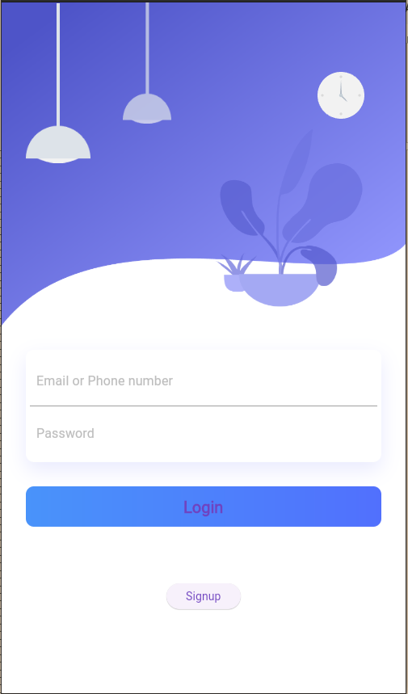{width="5.260416666666667in"
    > height="8.947916666666666in"}{width="5.260416666666667in"
    > height="8.947916666666666in"}

2.  **Home Page:** Once you\'re in, you\'ll land on the main page. There
    > are four choices for you -- Widgets, State Management, Navigation,
    > and Layouts/UI.\
    > 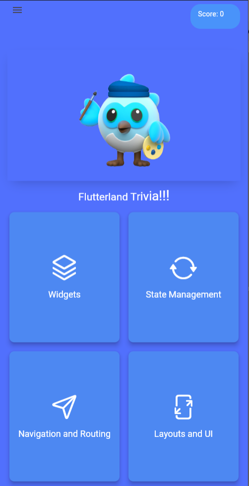{width="5.229166666666667in"
    > height="9.226145013123359in"}

3.  **Flippy Flashcards:** Wanna learn while having fun? We\'ve got
    > flashcards that flip like magic. They help you remember things
    > better.\
    > 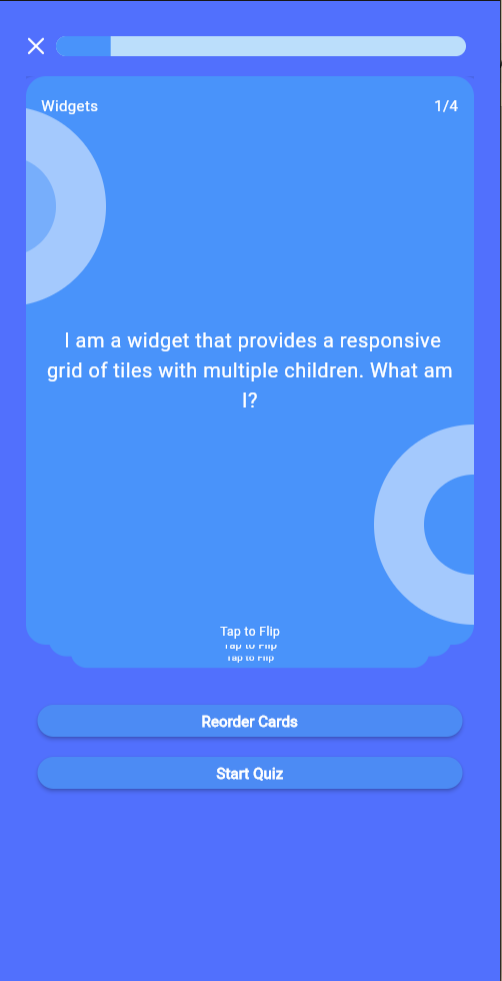{width="5.229166666666667in"
    > height="9.215728346456693in"}

> 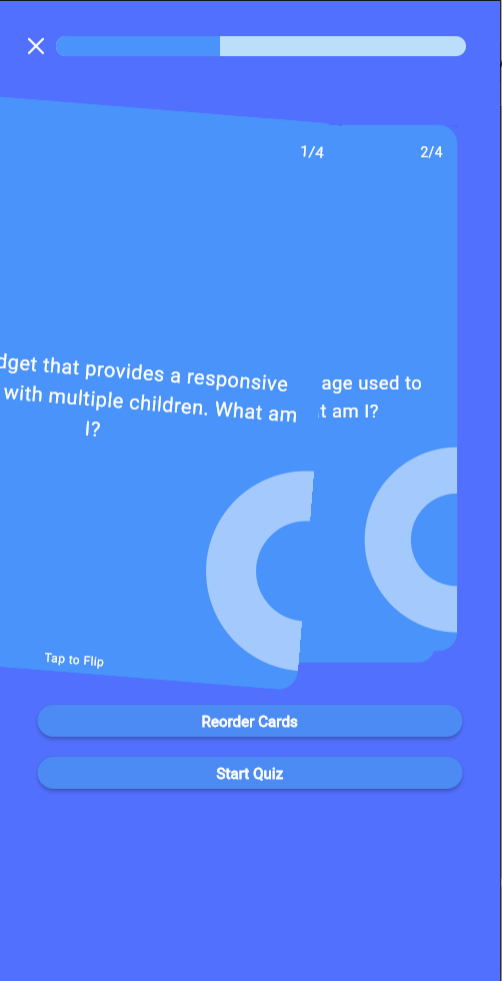{width="5.229166666666667in"
> height="10.21875in"}
>
> Also re-order the flash card for a better revision:
>
> 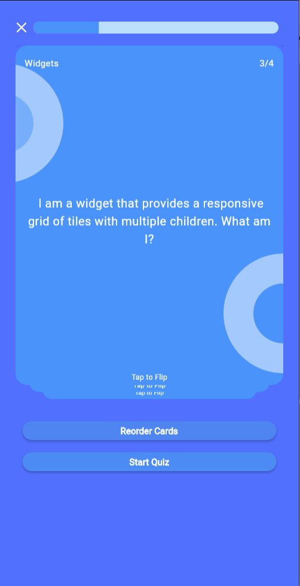{width="5.229166666666667in"
> height="9.268454724409448in"}

4.  **Taking Quizzes:** You can test what you\'ve learned with quizzes.
    > They\'ve got questions with multiple choices. You\'ll need to
    > answer fast, though -- there\'s a little timer ticking\
    > 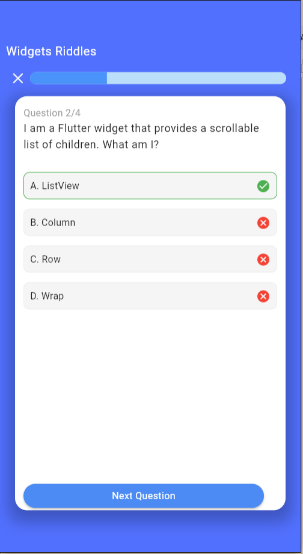{width="5.25in"
    > height="8.651943350831147in"}

5.  **Know How You Did:** After the quiz, we\'ll tell you how you did
    > and show you a cool picture that matches your score.\
    > {width="5.25in"
    > height="9.205311679790027in"}

You also have a sad GIF when you don't perform well:

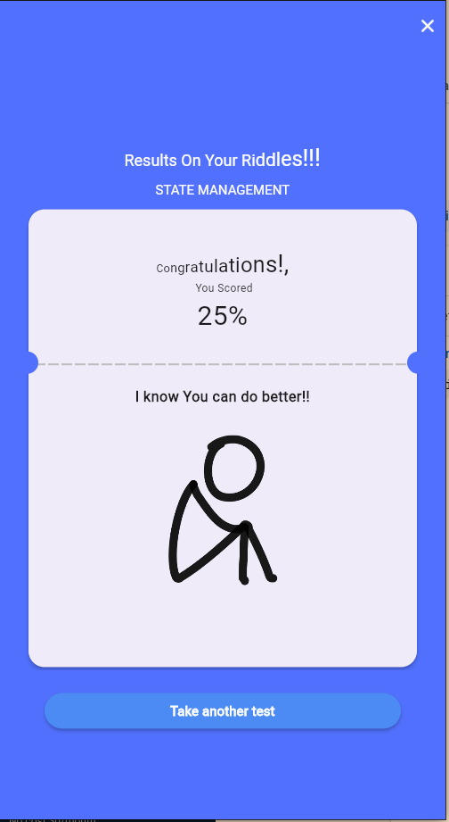{width="5.25in"
height="9.278871391076116in"}

6.  **Keep track of your score:\
    > **At the screen top left we see that the score updated with
    > previous scores(3+1). This way the user quiz track record is
    > kept.{width="5.21875in"
    > height="8.95119750656168in"}

7.  **Menu with Cool Choices:**

> There\'s a menu too!
>
> You can open it and find options to log out, delete your scores, or
> even say goodbye to your account if you want.
>
> There is the drawer.
>
> It contains various options:

1.  **Logout:**

> Logout logs out the user and redirects to home page

2.  **Delete Score history:**

Delete the quiz score history in firebase.

3.  **Delete User**

Deletes the user and associated data from the firebase

> 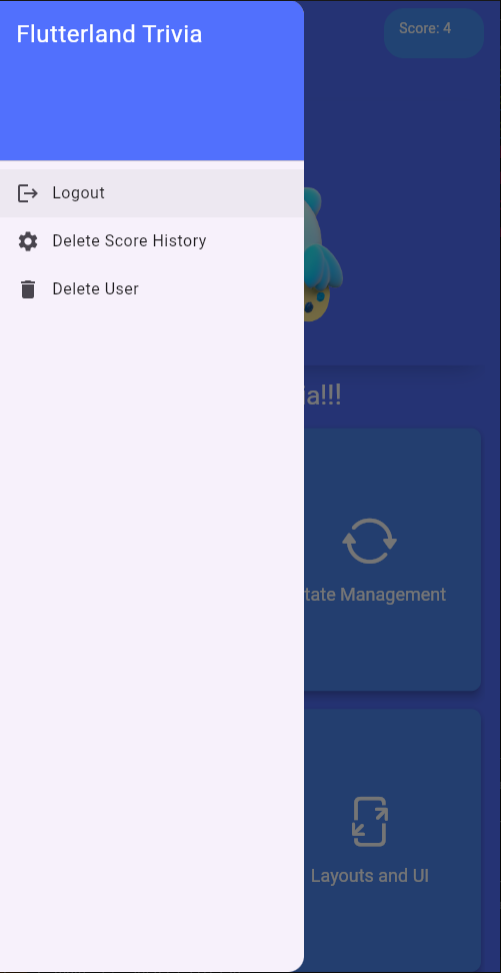{width="5.21875in"
> height="10.135416666666666in"}
>
> 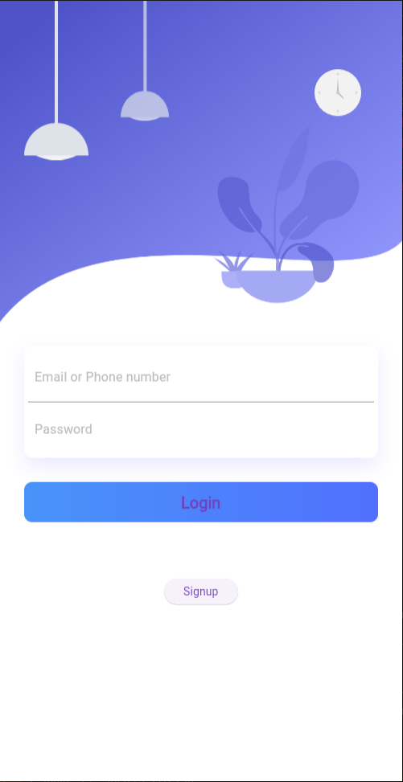{width="5.21875in"
> height="10.135416666666666in"}
>
> 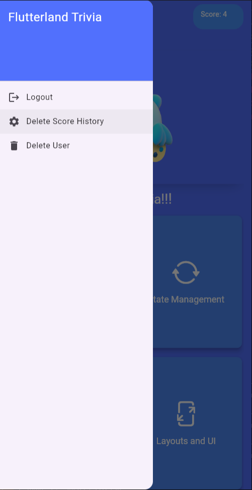{width="5.21875in"
> height="10.135416666666666in"}
>
> 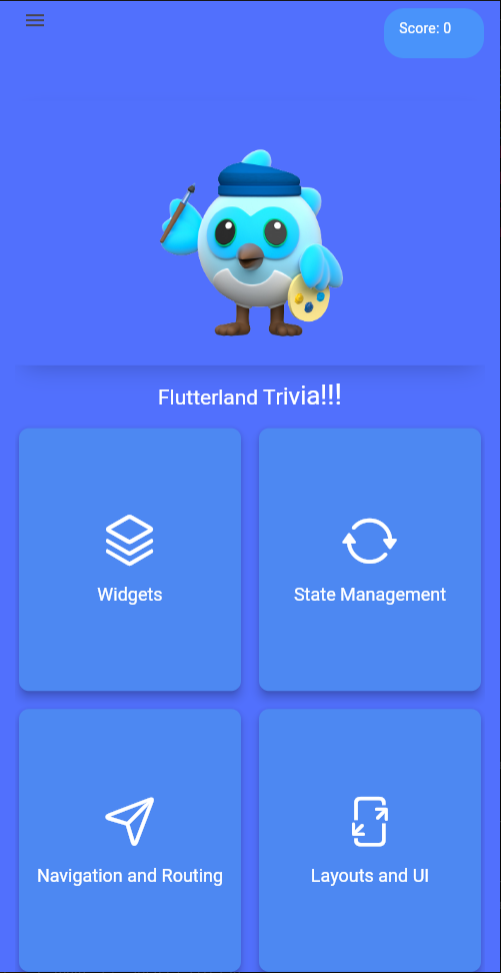{width="5.21875in"
> height="10.135416666666666in"}
>
> 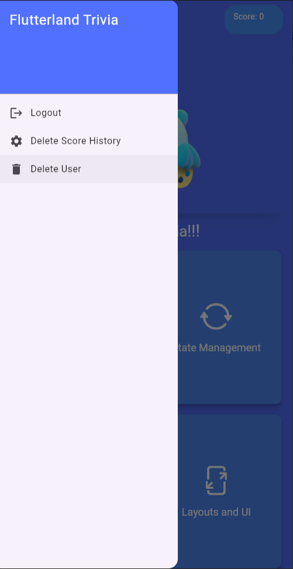{width="5.21875in"
> height="10.135416666666666in"}{width="5.21875in"
> height="10.135416666666666in"}
